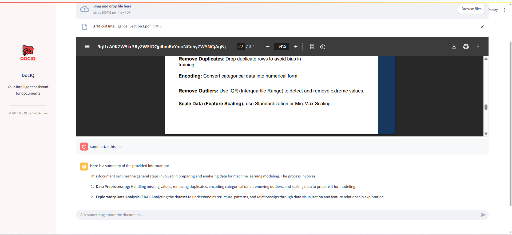

# DocIQ – Chat with Your Documents (RAG System)

## Overview
DocIQ is a real-time PDF assistant powered by open-source LLMs and vector search. 
Upload a PDF, and immediately start chatting with it.

---

## Features
- Upload and preview any PDF document
- Automatic text chunking and vector embedding using BGE (BAAI/bge-small-en)
- Real-time semantic search with Qdrant
- Local language model (LLaMA 3 via Ollama) to answer questions based on document content
- Clean, minimal chat interface using Streamlit

--- 

## DocIQ Screenshot



---

## Tech Stack
- **Frontend**: Streamlit
- **LLM**: LLaMA 3 (via [Ollama](https://ollama.com))
- **Embeddings**: BGE (sentence-transformers)
- **Vector DB**: Qdrant (Docker-based)
- **Framework**: LangChain

---

## Architecture
 - Embeddings: BGE (HuggingFace)
 - Vector DB: Qdrant
 - LLM: LLaMA3 (via Ollama / API)
 - Framework: LangChain

---

## Installation

### 1. Clone the repository

~~~
```bash
git clone https://github.com/engasmaaibrahim/Doc-IQ.git
cd Doc-IQ
~~~

### 2. Install dependencies

~~~
pip install -r requirements.txt
~~~

### 3. Start Qdrant (via Docker)

~~~
docker run -p 6333:6333 -p 6334:6334 qdrant/qdrant
~~~

### 4. Run Ollama with LLaMA 3

~~~
ollama run llama3
~~~

### 5. Launch the app

~~~
streamlit run app.py
~~~

---

## Author

**Asmaa Ibrahim**
AI & Machine Learning Engineer
